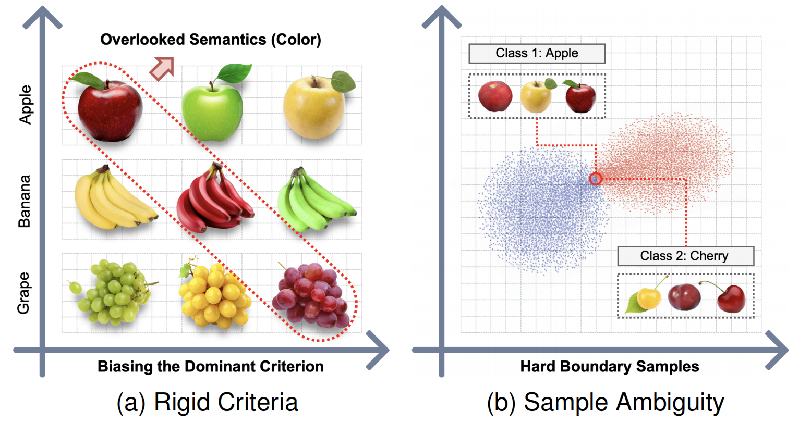
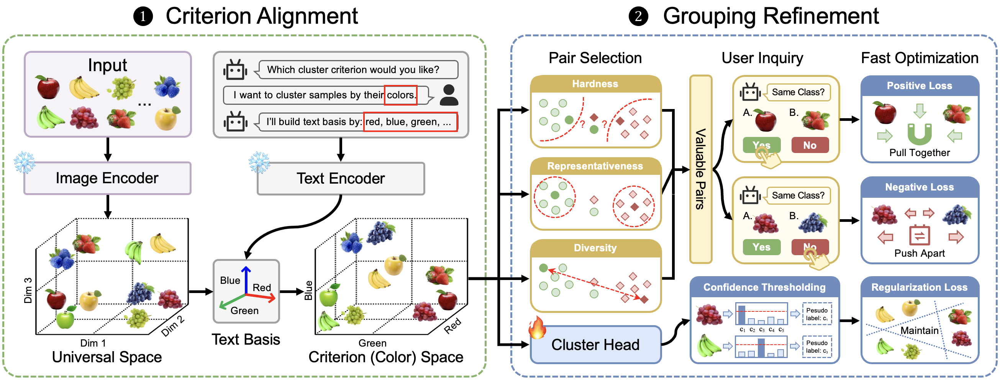

# Interactive Personalized Clustering

This repository contains the code for the TPAMI 2026 paper:

**Interactive Personalized Clustering: Navigating Beyond Rigid Criteria and Sample Ambiguity**



## Environment

The code was tested with the following environment:

- Python 3.9.20
- NumPy 1.26.4
- PyTorch 2.5.1 (`py3.9_cuda11.8_cudnn9.1.0_0`)
- torchvision 0.20.1
- tqdm
- munkres
- scipy
- scikit-learn
- CLIP
- faiss
- matplotlib

## Datasets

All datasets used in this project are publicly available.

For datasets that require our additional annotations, the corresponding annotation labels are provided in the `dataset` folder.



## Usage

### 1. Configure parameters

Before running the experiments, modify the relevant experimental settings in:

```bash
parse.py
```

This file contains the main configuration parameters used by the following scripts, such as the dataset and clustering-related settings.

### 2. Criterion Alignment

Run:

```bash
./compute_embedding.sh
```

This step extracts the **image representations** and **text representations** used by the method. It then performs the **Criterion Alignment** stage and computes the corresponding clustering results under the specified criterion.

### 3. Grouping Refinement

Run:

```bash
./our_pair_all.sh
```

This step selects **high-value sample pairs** for interaction based on the current clustering results. The selected pairs are used to supervise the subsequent refinement stage.

Run:

```bash
./our_pair_tuning_mlp.sh
```

This step performs **Grouping Refinement** using the selected sample pairs, updates the clustering results, and computes the final clustering performance.
